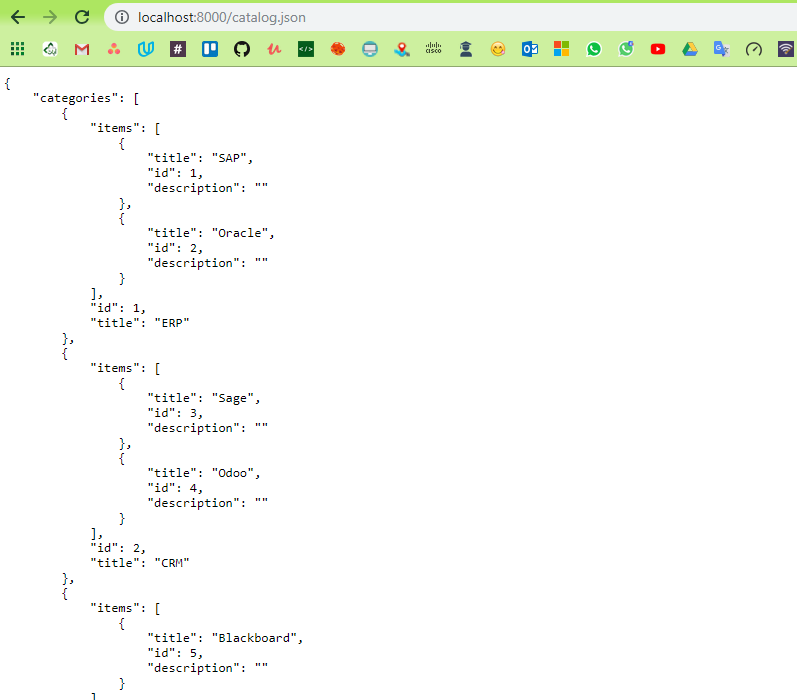

**Item Catalog Project**

This project is developed using python, and the main function is to create
categories and insert items linked to these categories.

Also, I used Google login as credential control, so no need to handle the login
credentials and user date locally.

**Prerequisites Software:**

-   User terminal like Git Bash or another terminal

-   Python 3.7 or above

-   Any python IDE, as Atom or VScode

-   Vagrant 2.2.1

-   Virtual box

-   Flask

**Libraries:**

-   Psycopg

-   PostgreSQL

-   Note, if you are going to use FSND_VM, these libraries already installed in
    the VM.

**Lets get Started:**

1.  Download the Git bash if you are windows user, if you are Linux or Mac user
    no need

2.  Download Python 3.7 or above

3.  Download and install the Vagrant 2.2.1 based on your OS
    ( <https://releases.hashicorp.com/vagrant/2.2.1/>)

4.  Open the git and start the below commands in step 5

5.  Download or Clone the FSND VM, which contain ready environment for this
    project requirement, download it then place it where you want,
    (<https://github.com/udacity/fullstack-nanodegree-vm>)

>   \$ git clone [https://github.com/udacity/fullstack-nanodegree
>   vm.git](https://github.com/udacity/fullstack-nanodegree-vm.git) FSND_VM

>   \$ cd FSND_VM

>   \$ cd vagrant

>   \$ vagrant up (\#Note that the path might change based on the download
>   location)

>   \$vagrant ssh

1.  Clone this repo:

\$ git clone https://github.com/Zakria-kh/Item.git

1.  Configure Google sign-in by opening config/passport.py, change the
    consumer_key & consumer_secret. ( if you don’t have one just create it
    through this
    [link](https://developers.google.com/identity/protocols/OAuth2WebServer#creatingcred))

2.  Install the project requirements:

\$ pip3 install -r requirements.txt

1.  Create database tables and insert category records which you already entered
    :

\$ python3 db.py migrate --seed --path database/migrations --seed-path
database/seeds

You can use the following command if you want to refresh the database:

\$ python3 db.py migrate:refresh --seed --path database/migrations --seed-path
database/seeds

**Run the application:**

\$ python3 main.py

Open [http://localhost:8000](http://localhost:8000/) from your browser.

**JSON Endpoint:**

The app provides all categories as JSON format through the link below:

<http://localhost:8000/catalog.json>

<http://localhost:8000/catalog/item.json>

**This project made with Love 😊**
